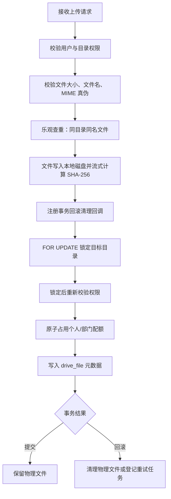
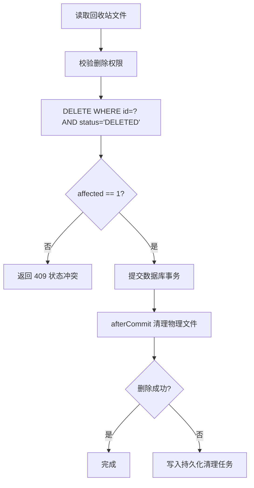
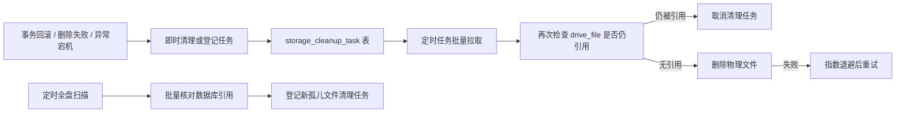
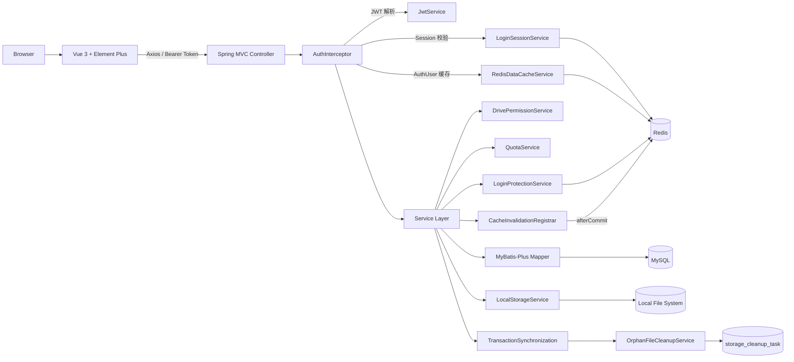

# 简易部门云盘（Simple Department Drive）

一个面向部门协作场景的文件管理系统，提供
**部门公共区、投稿区、个人空间、角色权限、文件上传下载、回收站、容量配额、登录安全加固、用户与部门管理**
等能力。

项目采用前后端分离设计。后端围绕文件系统中常见的
**权限、并发、一致性、逻辑删除、分页查询与物理文件生命周期**
做了较完整的工程化处理。

> 当前版本：V1.1

---

## 项目亮点

- **三级角色权限模型**：支持 `ADMIN / MINISTER / MEMBER`，并结合部门与文件区域进行细粒度权限控制。
- **三类文件空间**：部门公共区 `PUBLIC`、投稿区 `CONTRIBUTION`、个人空间 `PERSONAL`。
- **JWT + Session ID 双重认证**：JWT 负责身份凭证，Redis 保存当前有效 Session ID，实现单账号新登录覆盖旧会话、禁用/改密后旧 Token 失效。
- **登录安全加固**：基于 Redis Lua 脚本实现 IP 请求频率限制 + 用户名密码错误锁定双机制，防暴力破解与刷接口。
- **Redis 多级缓存**：AuthUser 认证缓存、用户详情缓存、部门缓存三级缓存体系，配合事务提交后失效注册器，解决"事务未提交缓存先删"的脏读问题。
- **文件真实类型校验**：使用 Apache Tika 读取文件内容识别 MIME Type，并与扩展名白名单进行双重校验，避免仅依赖前端 `Content-Type` 伪造。
- **SHA-256 流式摘要**：文件落盘过程中通过 `DigestOutputStream` 边写边计算 SHA-256，零额外 IO 开销。
- **原子容量配额控制**：个人空间与部门共享空间分别维护配额，通过条件 `UPDATE`（`used_bytes + ? <= quota_bytes`）原子判断剩余容量，避免并发上传导致超额。
- **事务与行锁保护**：上传、恢复、删除等关键流程通过 `SELECT ... FOR UPDATE` 锁定目标目录，降低目录被并发删除等状态竞争风险。
- **安全的永久删除**：使用 `DELETE ... WHERE id = ? AND status = 'DELETED'`，避免文件恢复与永久删除并发时误删已恢复记录。
- **回收站权限下推 SQL**：文件回收站通过 `JOIN drive_folder` 在数据库层完成权限过滤并分页，避免先查全量数据再在 Java 层过滤。
- **消除 N+1 查询**：文件列表与回收站批量收集 `uploaderId`，使用 `IN` 查询一次获取上传人信息，再在内存中组装 VO。
- **事务生命周期绑定文件清理**：通过 Spring `TransactionSynchronization` 将物理文件清理与事务提交/回滚生命周期关联。
- **孤儿文件兜底清理**：持久化清理任务 + 定时扫描 + 指数退避重试，处理事务回滚、删除失败、异常宕机等场景产生的孤儿文件。
- **统一异常处理与分页规范**：后端统一业务异常响应，前端统一处理登录失效；文件、用户、回收站列表全部分页。

---

## 功能概览

### 文件与文件夹

- 文件夹树形浏览
- 新建文件夹 / 重命名
- 文件上传与上传进度展示
- 文件下载（流式响应，支持断点）
- 文件逻辑删除 → 回收站
- 文件/文件夹回收站列表
- 文件/文件夹恢复
- 文件永久删除
- 同目录同名冲突处理（乐观查重 + 唯一索引兜底）
- 文件列表分页
- 回收站文件分页

### 权限与账号

- 用户登录 / 退出
- JWT Bearer Token 认证
- 单账号有效会话控制（新登录踢旧会话）
- 登录安全加固：IP 频率限制 + 密码错误次数锁定
- 用户禁用 / 启用
- 重置密码并使旧会话失效
- 用户分页管理
- 用户角色与部门调整
- 部门管理

### 存储与安全

- 单文件最大 50 MB
- 文件扩展名白名单
- Apache Tika MIME 真伪双重校验
- SHA-256 流式摘要计算
- 本地磁盘存储（按部门/年/月分目录）
- 路径穿越防护（`safeResolve` normalize + `startsWith` 校验）
- 个人空间 / 部门空间容量配额
- 事务回滚文件自动清理
- 永久删除后事务提交清理
- 孤儿文件定时扫描 + 持久化重试
- 指数退避控制重试频率
- 空目录自动回收

---

## 登录安全加固

系统在登录接口实现了双层安全防护，全部基于 Redis Lua 脚本保证原子性：

```
请求进入
  │
  ├─ 第一层：IP 频率限制
  │   每个 IP 在滑动时间窗口内最多允许 N 次登录请求
  │   超出 → 429 Too Many Requests
  │
  └─ 第二层：密码错误锁定
      每个用户名在时间窗口内连续密码错误达到阈值
      达到 → 锁定账号一段时间，期间拒绝登录
      密码正确 → 失败计数立即清零
```

| 配置项 | 默认值 | 说明 |
|--------|--------|------|
| `request-limit` | 30 | 单个 IP 每个窗口最大请求数 |
| `request-window-seconds` | 60 | IP 频率限制窗口（秒） |
| `max-password-failures` | 5 | 密码连续错误次数阈值 |
| `failure-window-seconds` | 600 | 失败计数窗口（秒） |
| `lock-seconds` | 600 | 账号锁定时长（秒） |

---

## Redis 多级缓存

```
请求 → AuthInterceptor
       │
       ├─ Redis Session 校验（判断 Token 是否有效）
       │
       ├─ AuthUser 缓存（认证信息，TTL=2min）
       │   ├─ HIT → 直接构造 CurrentUser
       │   └─ MISS → 查 MySQL → 状态检查 → 回填 Redis
       │
       └─ 业务层缓存
           ├─ 用户详情缓存（TTL=5min）
           ├─ 部门详情缓存（TTL=2min）
           └─ 部门列表缓存
```

**缓存失效策略**：通过 `CacheInvalidationRegistrar` 将缓存删除操作绑定到数据库事务的 `afterCommit` 回调，确保"数据提交成功后才删缓存"，避免事务回滚导致脏读。无事务时直接删除。

---

## 权限模型

| 角色 | 说明 |
|------|------|
| `ADMIN` | 系统管理员，可进行系统级用户、部门和文件管理 |
| `MINISTER` | 部门部长，可管理本部门公共区、投稿区以及自己的个人空间 |
| `MEMBER` | 普通成员，可访问本部门共享区域，并管理自己的个人空间和投稿文件 |

| 区域 | `ADMIN` | `MINISTER` | `MEMBER` |
|------|---------|------------|----------|
| `PUBLIC` 公共区 | 全部管理 | 本部门可管理 | 本部门可查看 |
| `CONTRIBUTION` 投稿区 | 全部管理 | 本部门可管理 | 本部门可上传；删除自己上传的文件 |
| `PERSONAL` 个人空间 | 全部管理 | 仅自己的空间 | 仅自己的空间 |

权限判断以后端为最终准则，前端路由和按钮权限只负责交互展示，不能替代服务端鉴权。

---

## 核心流程

### 文件上传



上传流程在真正写入数据库前会重新锁定目标目录，避免文件落盘期间目录被其他请求删除后仍继续提交文件元数据。

### 永久删除



### 孤儿文件三层保障



---

## N+1 查询优化

文件列表需要展示上传人姓名。逐文件执行 `SELECT sys_user` 会形成典型的 N+1 查询。

当前实现先收集当前页全部 `uploaderId`：

```text
DriveFile Page
    ↓
收集并去重 uploaderId
    ↓
SELECT * FROM sys_user WHERE id IN (...)
    ↓
Map<userId, SysUser>
    ↓
内存组装 FileView / TrashFileView
```

因此上传人信息查询由最多 N 次数据库访问降为 1 次批量查询。

回收站权限过滤则采用另一种策略：由于 `drive_folder` 中的 `department_id / area_type / owner_id` 会直接决定文件是否可见，因此通过 `JOIN + WHERE` 将权限条件下推数据库，再执行分页。

---

## 配额并发控制

个人空间与部门共享空间分别维护 `quota_bytes` 和 `used_bytes`。

上传时不采用"先 SELECT 再 UPDATE"的方式，而是使用条件更新：

```sql
UPDATE ...
SET used_bytes = used_bytes + ?
WHERE ...
  AND used_bytes + ? <= quota_bytes;
```

通过受影响行数判断是否成功占用配额，使"检查容量 + 扣减容量"成为一个原子数据库操作，降低并发上传导致容量超卖的风险。

删除文件时释放对应配额；恢复文件时重新占用配额。配额变更后通过 `CacheInvalidationRegistrar` 在事务提交后才失效缓存。

---

## 技术栈

### 后端

| 技术 | 版本 | 用途 |
|------|------|------|
| Spring Boot | 3.5.16 | 应用框架 |
| Spring MVC | - | REST API、拦截器、CORS |
| Spring Data Redis | - | Session 管理、缓存、Lua 脚本 |
| MyBatis-Plus | 3.5.13 | ORM、分页、条件构造器 |
| MySQL | 8.4 | 主数据存储 |
| jjwt | 0.13.0 | JWT 生成与校验（HS256） |
| Apache Tika | 3.3.2 | 文件 MIME 类型深度检测 |
| Spring Security Crypto | - | BCrypt 密码加密 |
| Jakarta Validation | - | 参数校验 |
| Lombok | - | 样板代码消除 |

### 前端

| 技术 | 用途 |
|------|------|
| Vue 3 | UI 框架 |
| Vue Router | 路由与角色权限控制 |
| Element Plus | UI 组件库 |
| Axios | HTTP 请求 |
| Vite | 构建工具与开发服务器 |

---

## 系统架构



---

## 主要数据模型

| 表 | 作用 |
|----|------|
| `sys_user` | 用户、角色、部门归属、个人配额、密码 |
| `sys_department` | 部门信息、部门共享空间配额 |
| `drive_folder` | 文件夹树、区域类型、Owner、逻辑删除状态 |
| `drive_file` | 文件元数据、上传人、存储路径、大小、SHA-256、MIME、删除状态 |
| `storage_cleanup_task` | 物理文件清理失败后的持久化重试任务 |

### Redis 数据结构

| Key 模式 | 用途 | TTL |
|----------|------|-----|
| `simple-drive:auth:session:{userId}` | 当前有效 Session ID | 与 JWT 过期时间一致 |
| `simple-drive:cache:auth-user:{userId}:{sessionId}` | 认证用户信息缓存 | 2 分钟 |
| `simple-drive:cache:user-detail:{userId}` | 用户详情缓存 | 5 分钟 |
| `simple-drive:cache:department:{deptId}` | 部门详情缓存 | 2 分钟 |
| `simple-drive:cache:department:list` | 部门列表缓存 | 2 分钟 |
| `simple-drive:security:login:rate:ip{ip}` | IP 登录频率计数 | 60 秒 |
| `simple-drive:security:login:failure:user:{username}` | 密码失败计数 | 10 分钟 |
| `simple-drive:security:login:lock:user:{username}` | 账号锁定标记 | 10 分钟 |

---

## 项目结构

```text
src/main/java/com/easypan/
├── EasypanDriveApplication.java       # 启动类
├── auth/                              # 认证模块
│   ├── AuthInterceptor.java           #   JWT 拦截器（Token→Session→缓存→用户上下文）
│   ├── CachedAuthUser.java            #   认证缓存精简数据
│   ├── CurrentUser.java               #   当前登录用户上下文
│   ├── JwtIdentity.java               #   JWT 解析结果
│   ├── JwtService.java                #   JWT 生成与校验（HS256）
│   ├── LoginProtectionService.java    #   登录安全加固（IP限流 + 密码锁定）
│   ├── LoginSessionService.java       #   Session 会话管理（Redis + Lua）
│   └── UserContext.java               #   ThreadLocal 用户上下文
├── cache/                             # 缓存模块
│   ├── CacheInvalidationRegistrar.java#   事务提交后缓存失效注册器
│   ├── CacheKeys.java                 #   缓存 Key 统一管理
│   ├── CacheProperties.java           #   缓存 TTL 配置
│   └── RedisDataCacheService.java     #   Redis 读写封装（旁路缓存，异常不阻断）
├── common/                            # 通用模块
│   ├── Result.java                    #   统一响应封装
│   └── ResultCode.java               #   标准错误码枚举
├── config/                            # 配置模块
│   ├── DemoDataInitializer.java       #   演示数据初始化
│   ├── MybatisPlusConfig.java         #   分页插件配置
│   ├── PasswordConfig.java            #   BCrypt 密码编码器
│   ├── TikaConfiguration.java         #   Apache Tika 检测器配置
│   └── WebMvcConfig.java              #   MVC 拦截器 + CORS 配置
├── controller/                        # REST API 控制层
│   ├── AuthController.java            #   登录/登出
│   ├── DepartmentController.java      #   部门管理
│   ├── FileController.java            #   文件上传/下载/删除/回收站
│   ├── FolderController.java          #   文件夹 CRUD/回收站
│   └── UserController.java            #   用户管理
├── exception/                         # 异常处理
│   ├── BusinessException.java         #   自定义业务异常（支持错误码）
│   └── GlobalExceptionHandler.java    #   全局统一异常处理器
├── mapper/                            # 数据访问层
│   ├── DriveFileMapper.java           #   文件 Mapper + 自定义 SQL
│   ├── DriveFolderMapper.java         #   文件夹 Mapper + 行锁查询
│   ├── StorageCleanupTaskMapper.java  #   清理任务 Mapper
│   ├── SysDepartmentMapper.java       #   部门 Mapper + 配额原子操作
│   └── SysUserMapper.java             #   用户 Mapper + 配额原子操作
├── model/                             # 数据模型
│   ├── dto/                           #   请求 DTO
│   ├── entity/                        #   数据库实体
│   ├── enums/                         #   枚举（角色、状态、区域类型）
│   └── vo/                            #   响应 VO（含分页 PageResult）
├── service/                           # 业务逻辑层
│   ├── AuthService.java               #   登录/登出业务
│   ├── DepartmentService.java         #   部门管理业务
│   ├── DriveFileService.java          #   文件核心业务（上传/下载/删除/恢复）
│   ├── DriveFolderService.java        #   文件夹业务（CRUD/回收站/恢复）
│   ├── DrivePermissionService.java    #   权限校验（三级角色 × 三类区域）
│   ├── FileMimeTypeService.java       #   MIME 类型双重校验
│   ├── OrphanFileCleanupService.java  #   孤儿文件清理 + 指数退避重试
│   ├── QuotaService.java              #   原子配额控制
│   ├── StorageCleanupTaskService.java #   清理任务持久化管理
│   ├── TransactionFileCleanupRegistrar.java  # 事务生命周期文件清理
│   └── UserService.java               #   用户管理业务
└── storage/                           # 存储抽象
    ├── LocalStorageService.java       #   存储接口
    ├── LocalStorageServiceImpl.java   #   本地磁盘实现（SHA-256 流式计算）
    ├── StorageProperties.java         #   存储配置
    ├── StorageObject.java             #   磁盘文件元数据
    └── StoredFile.java                #   存储结果
```

---

## 部署与运行

### 环境要求

- Java 17+
- MySQL 8.0+
- Redis 6.0+

### 快速启动

```bash
# 1. 启动 MySQL（可使用 docker-compose）
docker-compose up -d

# 2. 启动 Redis（需提前安装或容器化）
redis-server

# 3. 初始化数据库
#    创建 simple_drive 数据库并执行建表 SQL

# 4. 启动后端
mvn spring-boot:run
```

### 后端配置

默认后端端口：`8082`

`application.yml` 支持通过环境变量覆盖主要配置：

| 环境变量 | 默认值 | 说明 |
|----------|--------|------|
| `SERVER_PORT` | `8082` | 服务端口 |
| `DB_URL` | MySQL `simple_drive` | 数据库连接 |
| `DB_USERNAME` | `root` | 数据库用户名 |
| `DB_PASSWORD` | `123` | 数据库密码 |
| `REDIS_HOST` | `localhost` | Redis 地址 |
| `REDIS_PORT` | `6379` | Redis 端口 |
| `JWT_SECRET` | Base64 默认值 | JWT 签名密钥，**生产环境必须替换** |
| `JWT_EXPIRATION_SECONDS` | `86400` | Token 过期时间（秒） |
| `STORAGE_ROOT` | `./storage` | 文件存储根目录 |
| `STORAGE_CLEANUP_ENABLED` | `true` | 是否启用孤儿文件清理 |
| `STORAGE_ORPHAN_MIN_AGE` | `PT1H` | 孤儿文件最小年龄 |
| `STORAGE_CLEANUP_BATCH_SIZE` | `100` | 每轮批量处理数量 |

> **生产部署时请替换数据库密码、JWT Secret、Redis 密码，并将 CORS 来源限制为实际前端域名。**

---

## 演示账号

当 `DEMO_DATA_ENABLED=true` 时，后端启动会幂等初始化演示数据：

| 角色 | 用户名 | 密码 |
|------|--------|------|
| 系统管理员 | `admin` | `admin123` |
| 部门部长 | `minister` | `123456` |
| 普通成员 | `member` | `123456` |

> 演示账号仅用于本地开发和功能验证，部署公开环境时建议关闭。

---

## 接口概览

### 认证

```text
POST   /api/auth/login              # 登录（受 IP 频率限制）
POST   /api/auth/logout             # 登出
```

### 文件

```text
GET    /api/files                    # 文件列表（分页）
POST   /api/files/upload             # 文件上传
GET    /api/files/{id}/download      # 文件下载
DELETE /api/files/{id}               # 删除文件（逻辑删除）
GET    /api/files/trash              # 回收站（分页，权限下推 SQL）
PUT    /api/files/{id}/restore       # 恢复文件
DELETE /api/files/{id}/permanent     # 永久删除
```

### 文件夹

```text
GET    /api/folders                  # 子文件夹列表
POST   /api/folders                  # 创建文件夹
PUT    /api/folders/{id}             # 重命名文件夹
DELETE /api/folders/{id}             # 删除文件夹（逻辑删除）
GET    /api/folders/trash            # 文件夹回收站
PUT    /api/folders/{id}/restore     # 恢复文件夹
```

### 用户

```text
GET    /api/users                    # 用户列表（分页）
GET    /api/users/{id}               # 用户详情
POST   /api/users                    # 创建用户
PUT    /api/users/{id}               # 更新用户
PUT    /api/users/{id}/password      # 重置密码
PUT    /api/users/{id}/enable        # 启用/禁用用户
DELETE /api/users/{id}               # 删除用户
```

### 部门

```text
GET    /api/departments              # 部门列表
GET    /api/departments/{id}         # 部门详情
POST   /api/departments              # 创建部门
PUT    /api/departments/{id}         # 更新部门
DELETE /api/departments/{id}         # 删除部门
```

---

## 文件上传限制

当前允许的文件类型：

| 类型 | 扩展名 |
|------|--------|
| 图片 | jpg / jpeg / png / gif |
| 文档 | pdf / doc / docx / xls / xlsx / ppt / pptx |
| 文本 | txt / md |
| 压缩 | zip |

系统不直接信任浏览器 `Content-Type`，而是使用 Apache Tika 检测文件二进制内容，并校验真实 MIME 与扩展名是否匹配。

单文件最大：**50 MB**

---

## 测试

| 测试类 | 覆盖场景 |
|--------|----------|
| `SessionKickoutTest` | 单点登录踢下线：两次登录 → 旧 Token 失效 → 新 Token 正常 |
| `LocalStorageServiceImplSha256Test` | SHA-256 流式计算：已知内容校验、相同内容一致性 |
| Spring Boot Context | 应用上下文加载 |

后续建议补充：

- 上传与删除的事务一致性集成测试
- 文件恢复 / 永久删除并发测试
- 配额并发扣减测试
- 权限矩阵集成测试
- 孤儿文件清理与重试测试

---

## 后续优化方向

- 使用 `EXPLAIN ANALYZE` 根据真实查询计划优化文件列表与回收站联合索引
- 文件夹回收站增加分页与 SQL 权限下推
- 对象存储适配（MinIO / OSS / S3）
- 增加操作审计日志
- 文件预览、全文搜索与版本管理
- 增加自动化集成测试与 CI/CD
- 引入 Redis 分布式锁替代部分行锁场景

---

## 设计原则

这个项目重点关注的不是"堆功能"，而是文件系统业务中几个容易被忽略的问题：

```text
权限是否以后端为准？
并发上传会不会超配额？
上传失败会不会留下孤儿文件？
数据库提交失败后磁盘文件怎么办？
永久删除和恢复并发会不会误删？
回收站数据量变大后是否还能分页？
列表关联用户信息会不会产生 N+1？
用户被禁用、改密或异地登录后旧 Token 是否还能继续使用？
大量登录请求会不会被恶意刷？
缓存和数据库数据不一致怎么办？
```

当前实现围绕这些问题给出了对应的工程化处理，并保留了进一步扩展到对象存储、审计、搜索等能力的空间。
